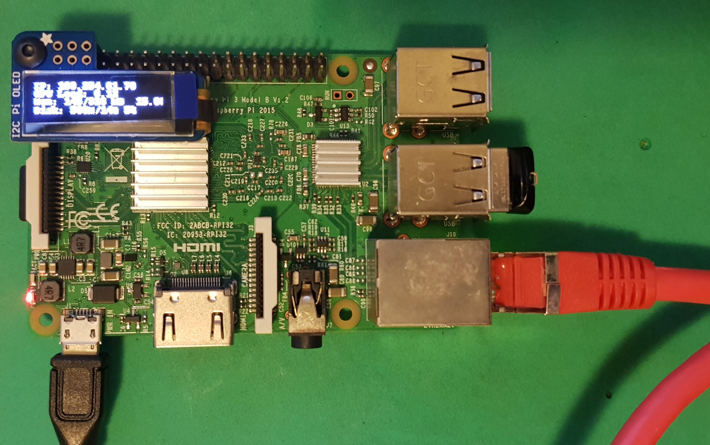

## MyNas

A NAS server project based on Raspberry Pi and Samba. 

[](https://www.gnu.org/licenses/gpl-3.0)



###### Installation

Update and upgrading Raspbian: 

```bash
sudo apt-get update
sudo apt-get dist-upgrade
```


###### Installing Web Stack

Installing Apache web server

```bash
sudo apt install apache2
```

Installing PHP

```bash
sudo apt install php php-mbstring
```

Installing MySQL database

```bash
sudo apt install mysql-server php-mysql
```


###### Apache .httaccess File Setting

**Issue:** The local .httaccess rewrite mode does not work on the some versions. You must fix it as follow.

For apache version 2.4 and later, you have to go to

```bash
sudo nano /etc/apache2/apache2.conf
```

Change AllowOverride None to AllowOverride All directory text like this;

```
<Directory /var/www/>
    Options Indexes FollowSymLinks
    AllowOverride All
    Require all granted
</Directory>
```

The above change on some versions will not take effect, fix it by bellow lines.  

```bash
sudo a2enmod rewrite
sudo systemctl restart apache2
```


###### Preparing the Admin panel

- Delete the index.html file from /var/www/html/ 

  ```bash
  sudo rm /var/www/html/index.html
  ```

  Copy all the files from this repository /html by WinSCP (or any other way) windows application to 

- Change the path to /var/www/html/ 

  ```bash
  cd /var/www/html
  ```

  Now you should import the users.sql file to database.

  ```bash
  sudo mysql -u root -p < users.sql
  ```

  If you have followed all stages up yo now then password is blank for root in MySQL (change it later to a more secure password).
- If everything is fine then remove the data base schema file for the security sake.

  ```bash
  sudo rm /var/www/html/users.db 
  ```

  Add php mysql user account to MySQL server: 

  ```bash
  sudo mysql -u root -p
  ```

  Grant permission to your custom username and password. In the bellow line as example the username is `'admin'` and password is `'password'`.

  ```mysql
  GRANT ALL PRIVILEGES ON mynas.* TO 'admin'@'localhost' IDENTIFIED BY 'password'; 
  ```

  Type \q to quit MySQL server.
  `\q`


- Enter the last stage MySQL username and password in the config.php file.
  `sudo nano /var/www/html/config.php`

  - Example:

```php
<?php
/* Database credentials.(user 'admin' with password 'password') */
    define('DB_SERVER', 'localhost');
    define('DB_USERNAME', 'admin');
    define('DB_PASSWORD', 'password');
    define('DB_NAME', 'mynas');
  
  /* Attempt to connect to MySQL database */
  try{
      $pdo = new PDO("mysql:host=" . DB_SERVER . ";dbname=" . DB_NAME, DB_USERNAME, DB_PASSWORD);
      $pdo->setAttribute(PDO::ATTR_ERRMODE, PDO::ERRMODE_EXCEPTION);
  } catch(PDOException $e){
      die("ERROR: Could not connect. " . $e->getMessage());
  }
?>
```

  


- Chang the syscmd.sh file group and mode.

  ```bash
  sudo chown www-data:www-data /var/www/html/syscmd.sh
  ```

  ```bash
  sudo chmod +x /var/www/html/syscmd.sh
  ```

- Fix first time www-data group access file question by opening this file in the text editor.

  ```bash
  sudo nano  /etc/sudoers 
  ```

  Add following line in the end of file and then save and exit.
  `www-data ALL=(ALL) NOPASSWD: ALL`


###### System Startup Settings

Give the execution permission to services programs and put it in the start up.

```bash
cd /var/www/html
sudo chmod +x my-nas-service.py
sudo nano /etc/rc.local
```

<add following lines to the end of file I have brought here full file template>

```bash
#!/bin/sh -e
#
# rc.local
#
# This script is executed at the end of each multiuser runlevel.
# Make sure that the script will "exit 0" on success or any other
# value on error.
#
# In order to enable or disable this script just change the execution
# bits.
#
# By default this script does nothing.

# Print the IP address
_IP=$(hostname -I) || true
if [ "$_IP" ]; then
  printf "My IP address is %s\n" "$_IP"
fi
(sleep 30;/usr/bin/python3 /dev/www/html/my-nas-service.py)&
sleep 60 && service smbd start&
exit 0
```


###### Installing Samba on Raspberry Pi

```bash
sudo apt-get install samba samba-common-bin smbclient cifs-utils
```

Sharing a folder for use by Windows
1- Connect your external drive! (e.g. memory stick or external hard drive).

2- Find the path to the external storage and keep it for the next setting. We must to tell to samba to look at this path as windows share folder. 

​	Note: this software works only with one external storage. So do not connect more than one storage.

```bash
ls /media/pi
```

3- Edit samba config file file. 

```bash
sudo nano /etc/samba/smb.conf
```

4- Add following lines to the end of the config file 

```
[global]
browseable = yes
netbios name = MY_NAS
server string = My NAS File Center
workgroup = "WORKGROUPE"

[My Folder]
browseable = yes
read only = no
public = yes
writable = yes
path = "/media/pi/UBUNTU18_0"
force user = root
create mask = 0777
directory mask = 0777
```

**Note:** In the same file, find the workgroup line, and if it is necessary, change it to the name of the workgroup of your local Windows network. 

5- We must stop auto start behavior of Samba at booting process of OS. To do this, open this smbd.conf and comment out this line *start on local-filesystem*

```bash
sudo nano /etc/init/smbd.conf
```

```
#start on local-filesystem
```


###### Install Adafruit CircuitPython (here explanations are from Adafruit)

I used this <https://www.adafruit.com/product/3527> model OLED display from Adafruit for MyNas project.

```bash
sudo pip3 install adafruit-circuitpython-ssd1306
```

If that complains about pip3 not being installed, then run this first to install it:

```bash
sudo apt-get install python3-pip
```

We also need PIL to allow using text with custom fonts. There are several system libraries that PIL relies on, so installing via a package manager is the easiest way to bring in everything:

```bash
sudo apt-get install python3-pil
```

Enabling I2C:
       Note: This oled module works with I2c. Do not connect it before enabling the I2C.

```bash
sudo raspi-config
```

1. Use the down arrow to select 5 Interfacing Options

2. Arrow down to P4 SPI.

3. Select yes when it asks you to enable SPI,

4. Also select yes if it asks about automatically loading the kernel module.

5. Use the right arrow to select the <Finish> button.

6. Turning off machine:

  ```bash
  sudo shutdown -h now
  ```

  

**Note:** when the machine is off and power cord is removed then connect the oled module and turn on the machine.


